# TaiT CRT Interface Skill
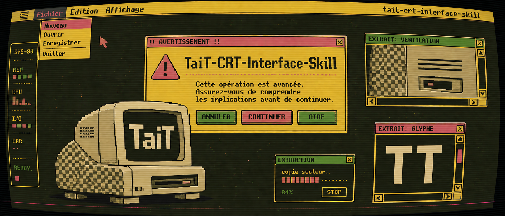

TaiT-CRT-Interface-Skill是一个Codex的图片生成skill，将用户上传的人像、摄影或文字描述等主题设计成一张带有早期CRT计算机界面质感的复古插画。

TaiT-CRT-Interface-Skill is a Codex image generation skill that transforms user-uploaded portraits, photographs, or text descriptions into a retro illustration with the feel of an early CRT computer interface.

---

## 视觉特征

- 一个占据画面主要面积的像素风主体，作为无边框系统壁纸
- 早期 Macintosh、Minitel 与 8-bit 计算机界面语言
- 3–6 个大小、比例和位置各异的悬浮视窗
- 1–3 个用于展示五官、饰品或局部特征的元素提取视窗
- 主体、文字、图标和窗口共用同一个方形像素网格
- 棋盘格光学灰度、硬边锯齿、扫描线、辉光、噪点和信号干扰
- 四周固定的 CRT 球面桶形畸变
- 多套预设色卡，也可以根据上传图片自动创作 2–5 色

## 生成示例 / Examples

<table border="1" cellspacing="0" cellpadding="8">
  <thead>
    <tr>
      <th align="center">参考图</th>
      <th align="center">tait-crt-interface生成</th>
      <th align="center">参考图</th>
      <th align="center">tait-crt-interface生成</th>
    </tr>
  </thead>
  <tbody>
    <tr>
      <td align="center" valign="middle"></td>
      <td align="center" valign="middle">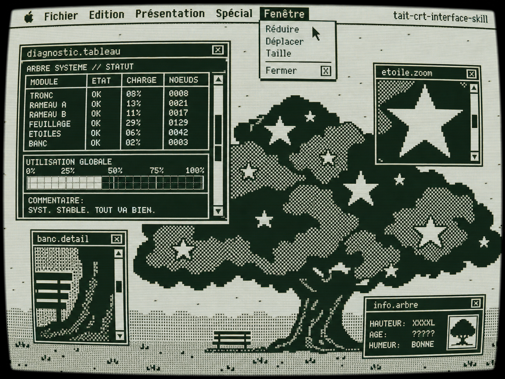</td>
      <td align="center" valign="middle"></td>
      <td align="center" valign="middle">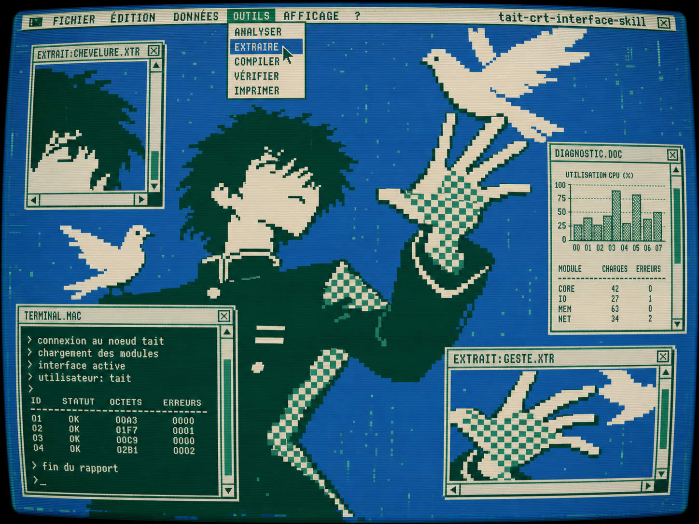</td>
    </tr>
    <tr>
      <td align="center" valign="middle"></td>
      <td align="center" valign="middle">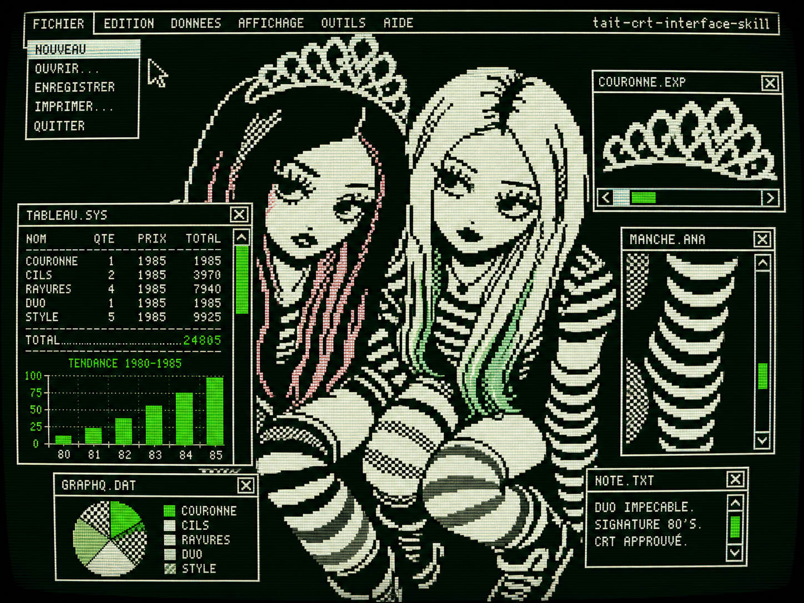</td>
      <td align="center" valign="middle"></td>
      <td align="center" valign="middle">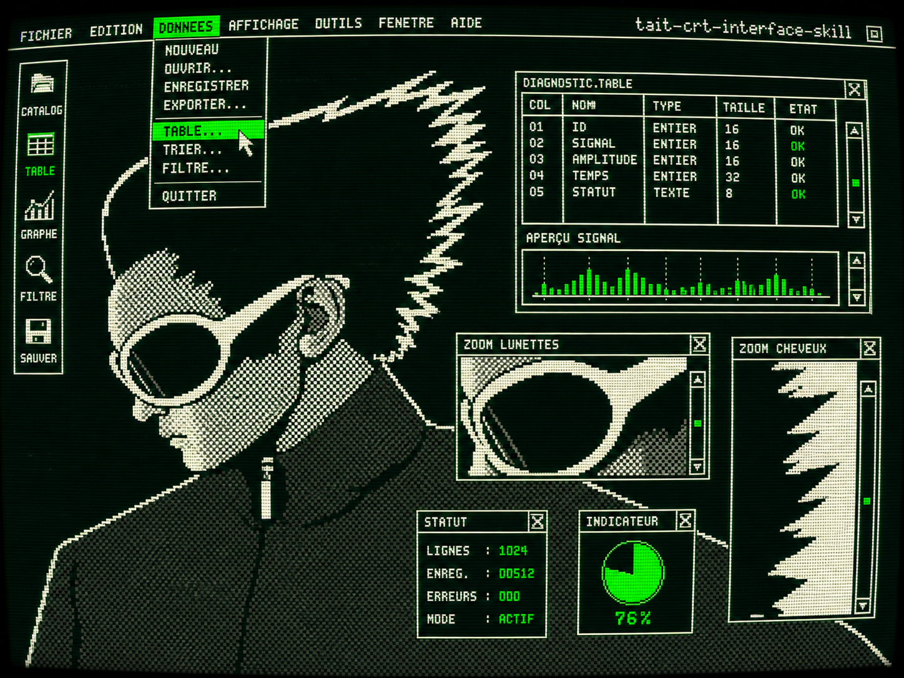</td>
    </tr>
    <tr>
      <td align="center" valign="middle"></td>
      <td align="center" valign="middle">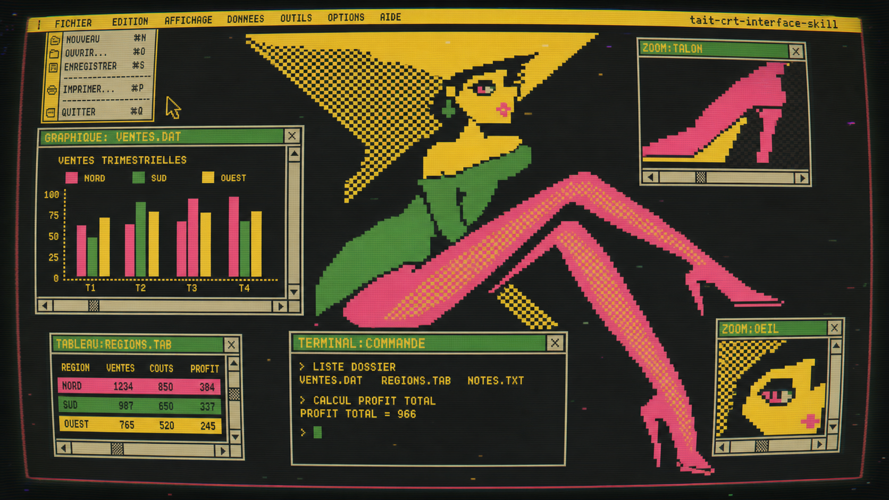</td>
      <td align="center" valign="middle"></td>
      <td align="center" valign="middle">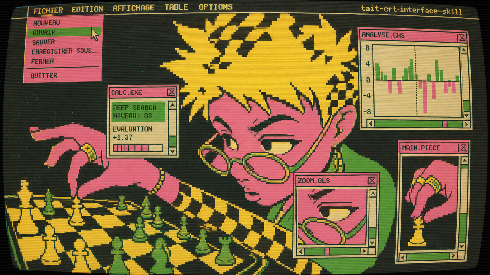</td>
    </tr>
    <tr>
      <td align="center" valign="middle"></td>
      <td align="center" valign="middle">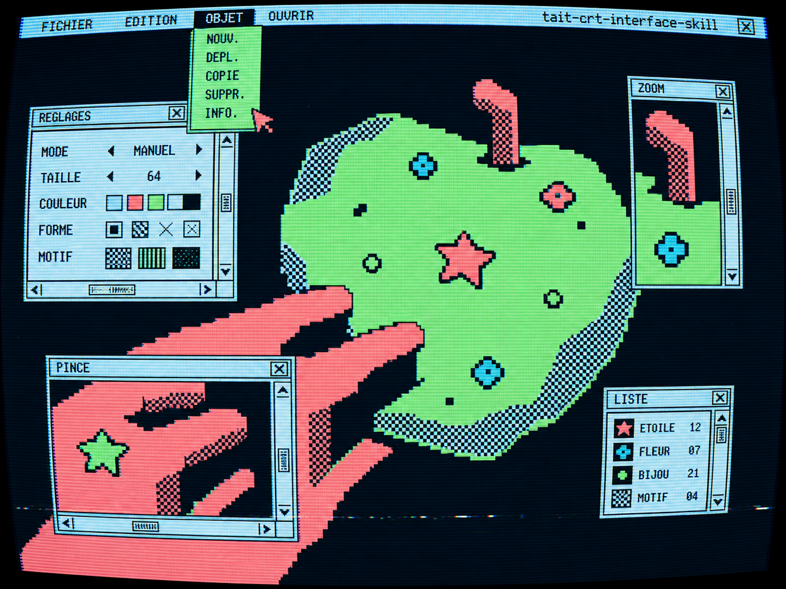</td>
      <td align="center" valign="middle"></td>
      <td align="center" valign="middle">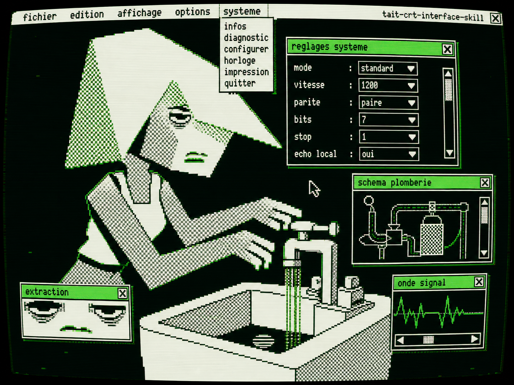</td>
    </tr>
    <tr>
      <td align="center" valign="middle"></td>
      <td align="center" valign="middle">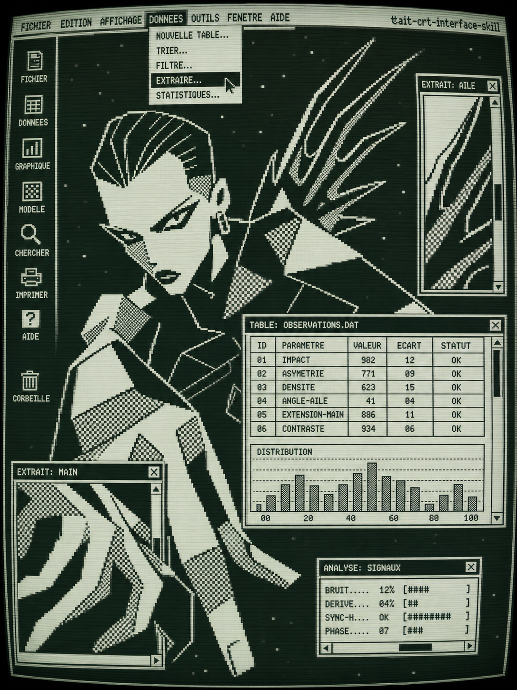</td>
      <td align="center" valign="middle"></td>
      <td align="center" valign="middle">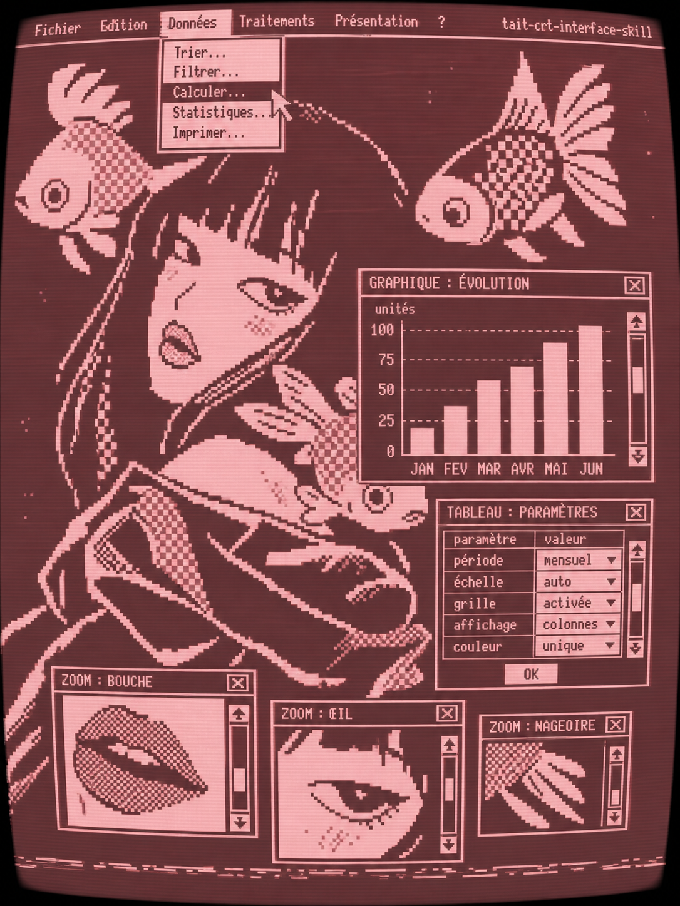</td>
    </tr>
  </tbody>
</table>

---

### 安装

方法一：将整个 Skill 文件夹下载后放入本地 Codex 的技能目录：

```text
~/.codex/skills/tait-crt-interface-skill
```

方法二：直接让 Codex 自动安装 Skill：

```text
请帮我安装这个GitHub链接中的skill：https://github.com/TaiT-tt/tait-crt-interface-skill
```

在codex中可调用的名称为：`tait-crt-interface-skill`。

### 使用方法

上传一张参考图片，然后按名称调用：

```text
使用 $tait-crt-interface-skill 把这张图片生成 CRT 复古电脑界面插画
```

但是这种情况下，没有提前指定色彩和比例，Skill 会分两轮对话询问：

1. 先展示色卡，请你选择 `经典`、`粉黛`、`极客01`、`极客02`、`复古01`、`复古02`、`游戏01`、`游戏02`，或回复 `如图`。
色卡如下所示：
<p align="left">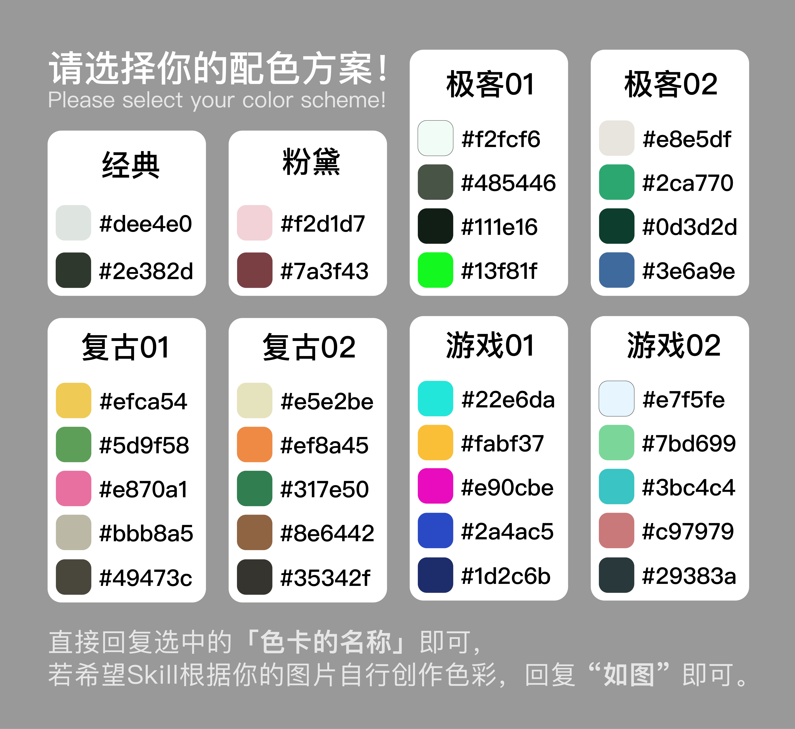</p>
2. 再选择 `3:4`、`4:3`、`9:16`、`16:9`，也可以输入其他比例。

也可以在第一次调用时直接标明色卡和比例，从而立即生成：

```text
使用 $tait-crt-interface-skill 生成图片，极客02色卡，4:3比例
```

另外，也鼓励大家开发此skill的更多玩法，如通过纯文字描述抽象视觉意象生成、带有指定文字信息的复古海报生成、在弹窗中指定自己需要的分析类型（如解剖、六角战力图、运势、场记板、化学式等等），不限玩法，用户的指令已被设定为第一层级，可覆盖本skill大部分固有设定。

---

### 文件结构

- `SKILL.md`：完整工作流、构图规则和质量门槛
- `README.md`：简体中文与英文使用说明
- `assets/`：色卡等交互资产
- `references/`：色彩与需求规范
- `scripts/`：共享像素网格、色卡约束、CRT 畸变与固定署名处理
